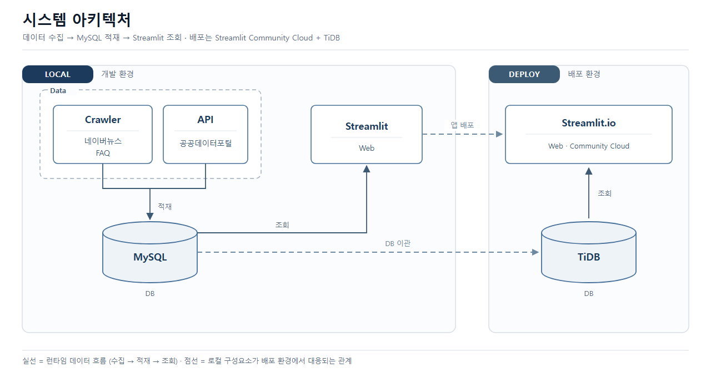
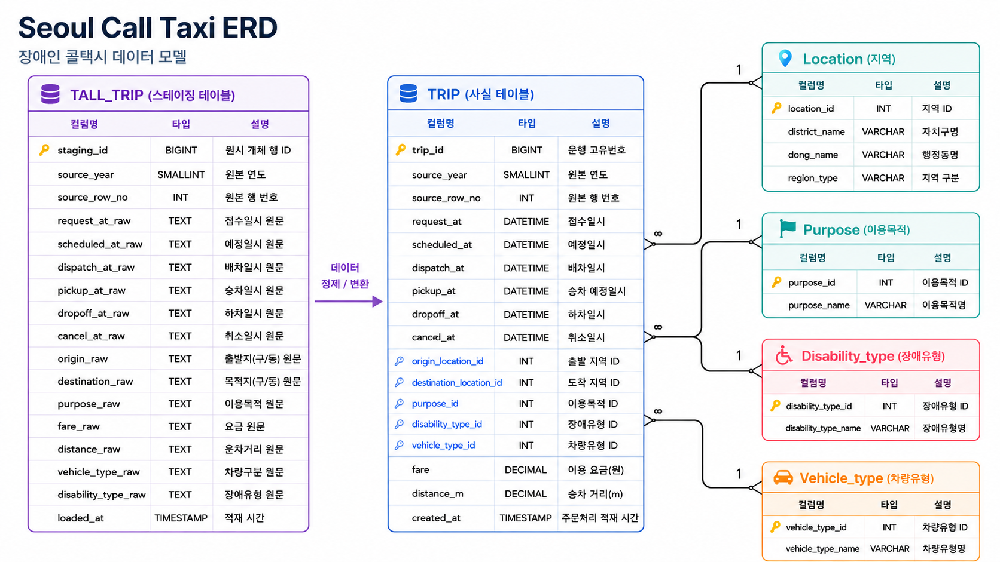
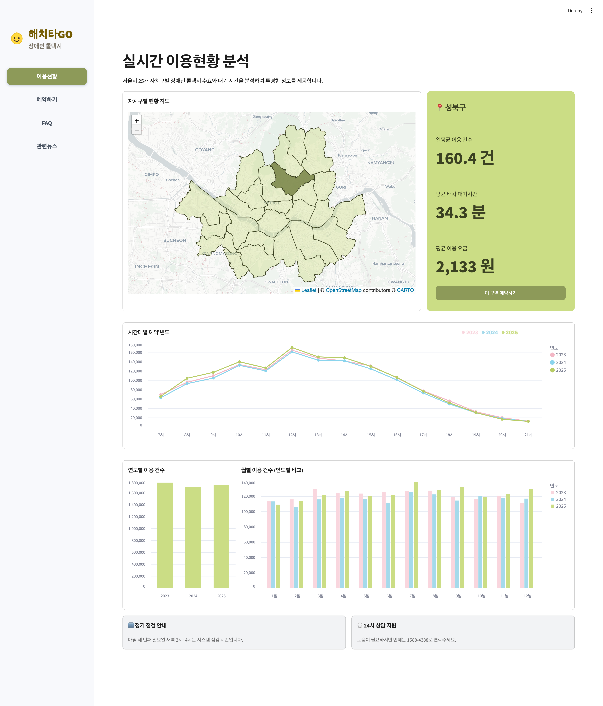
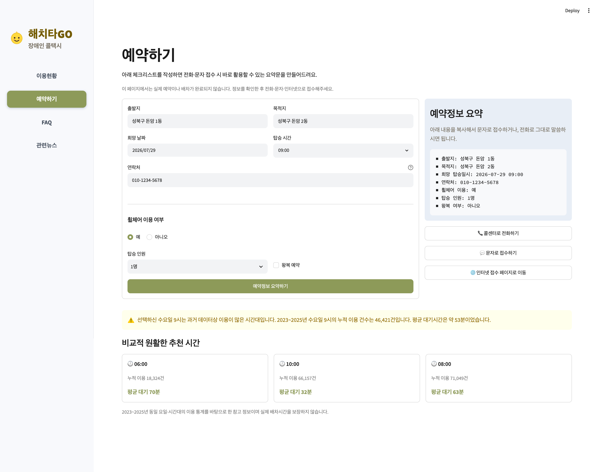
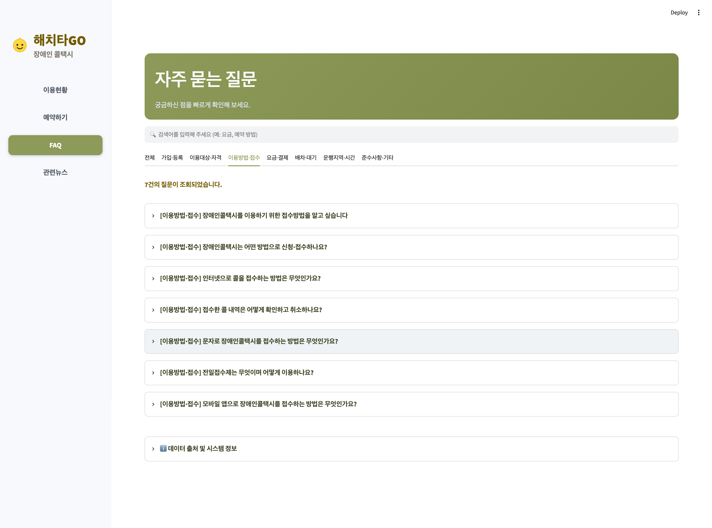
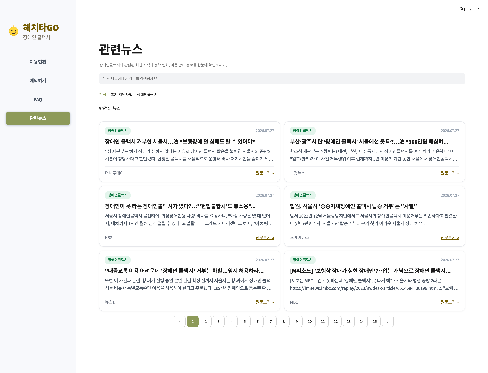

# 해치타GO

> 서울시 장애인콜택시 이용현황 분석 및 조회 시스템   
> "해치하GO" 배포 링크 https://skn35-1st-1team-asmrgnabdghsxfswvxopzm.streamlit.app/


## 프로젝트 소개

서울시 장애인콜택시 관련 공공데이터를 분석·조회하고, 실제 이용(예약 준비, FAQ 확인, 관련 정보 파악)에 실질적으로 도움을 주는 시스템입니다. 장애인 당사자와 보호자가 접근성 높게 이용할 수 있도록, 큰 버튼과 직관적인 메뉴 구성으로 설계했습니다.

### 1. 기획 배경 (Problem)

- **병원 방문 중심의 이동 수요**: 교통약자인 장애인 이용자의 대다수는 병원 진료, 정기 검사, 수술 등 필수 의료 목적을 위해 장애인 콜택시를 이용합니다.
- **예약 및 대기시간 예측의 불확실성**: 1~2달 뒤로 예정된 병원 진료 일정에 맞춰 콜택시를 예약하거나, 당일 배차 대기시간을 실시간으로 가늠하기 어려워 이동 계획 수립에 큰 불편을 겪고 있습니다.

### 2. 문제 정의 (Insight)

장애인 콜택시는 수요 대비 공급의 한계로 인해 지역별·시간대별 배차 대기시간의 편차가 큽니다. 예측하기 힘든 대기시간은 병원 예약 시간 미준수, 불필요한 장시간 대기 등 장애인 이용자의 삶의 질 저하 및 의료 접근성 저해로 이어집니다.

### 3. 해결 방안 (Solution)

- **데이터 기반의 이동현황 및 정보 제공**: 서울시설공단의 장애인 콜택시 운행 빅데이터(2023~2025년 기준)를 분석하여, 자치구별·시간대별 일평균 이용건수 및 예상 대기시간을 한눈에 파악할 수 있는 시각화 시스템을 구축했습니다.
- **효율적인 내원 일정 수립 지원**: 이용자가 사전에 콜택시 이용 현황과 혼잡도를 미리 확인하고, 이를 바탕으로 병원 진료·검사 일정을 전략적으로 조정할 수 있도록 돕습니다.

### 4. 기대 효과 (Impact)

- **이동 예측 가능성 확보**: 불확실한 콜택시 대기시간을 데이터로 예측 가능하게 만들어 이용자의 심리적 불안감을 완화합니다.
- **효율적 배차 지원 및 이동 편의 증대**: 혼잡 시간대를 피한 병원 예약 설정을 유도하여 대기시간 단축 및 이동 효율성을 극대화합니다.
- **의료 접근성 향상**: 정기 검사 및 수술 등 필수적인 의료 서비스를 제때 안심하고 이용할 수 있는 이동 환경을 조성합니다.

## 팀 소개
| 이름 | 역할 |
|---|---|
| 최우석 | PM(팀장) / 코드 검토 및 취합 / 배포 테스트 |
| 박수휘 | Git 형상관리 / Streamlit 시각화 구현 / 이용현황 화면 구현 |
| 심성욱 | 데이터 크롤링 / 수집 데이터 정제 / 관련 뉴스 화면 구현 / 발표 |
| 이세희 | 데이터 크롤링 / Streamlit UI 설계 및 구현 / FAQ 화면 구현 |
| 이형민 | API 데이터 정제 / 데이터베이스 스키마 설계 / 예약하기 화면 구현 |

## 시스템 구성도


📅 WBS & 개발 일정
| 구분 | 작업 | 7/21 | 7/22 | 7/23 | 7/24 | 7/27 | 7/28 |
|------|------|:----:|:----:|:----:|:----:|:---:|:---:|
| 📋 기획 | 주제 선정 | 💛 | 💛 | 🤍 | 🤍 | 🤍 | 🤍 |
| | 데이터 탐색 | 🤍 | 💛 | 💛 | 🤍 | 🤍 | 🤍 |
| | 화면 기획 | 🤍 | 🤍 | 💛 | 💛 | 🤍 | 🤍 |
| 📚 DB 설계 | DB 테이블 스키마 설계 | 🤍 | 🤍 | 💛 | 💛 | 💛 | 🤍 |
| ⚙️ 데이터 수집 및 정제 | API 및 파일 데이터 확보 | 🤍 | 🤍 | 💛 | 💛 | 🤍 | 🤍 |
| | 네이버 뉴스 데이터 수집 | 🤍 | 🤍 | 🤍 | 💛 | 💛 | 🤍 |
| | 수집 데이터 전처리 | 🤍 | 🤍 | 🤍 | 💛 | 💛 | 🤍 |
| | DB 적재 | 🤍 | 🤍 | 🤍 | 🤍 | 💛 | 🤍 |
| 🖥️ 화면 구현 | 화면 UI 생성 | 🤍 | 🤍 | 🤍 | 💛 | 💛 | 🤍 |
| | 이용 현황 화면 구현 | 🤍 | 🤍 | 🤍 | 💛 | 💛 | 💛 |
| | 예약하기 화면 구현 | 🤍 | 🤍 | 🤍 | 💛 | 💛 | 💛 |
| | FAQ 화면 구현 | 🤍 | 🤍 | 🤍 | 🤍 | 💛 | 💛 |
| | 관련 뉴스 화면 구현 | 🤍 | 🤍 | 🤍 | 🤍 | 💛 | 💛 |
| ✅ 배포 및 테스트 | streamlit 배포 및 테스트 | 🤍 | 🤍 | 🤍 | 🤍 | 💛 | 💛 |
| | TiDB 데이터 적재 및 연동 테스트 | 🤍 | 🤍 | 🤍 | 🤍 | 💛 | 💛 |

## 화면 구성

메인 화면 하단에 4개의 대형 메뉴 버튼을 배치했습니다.

| 메뉴 | 설명 |
|---|---|
| **이용현황** | 서울시 25개 자치구 지도 클릭 조회, 시간대별 예약 빈도 통계, 혼잡도 추이 |
| **예약하기** | 예약 전 체크리스트 입력 → 요약 정보 생성 → 전화/문자/인터넷접수 안내, 실시간 혼잡 시간대 안내문구 |
| **FAQ** | 서울시설공단 공식 안내(가입/이용기준/접수방법) 기반 FAQ |
| **관련뉴스** | 네이버뉴스 "장애인 콜택시" 검색결과 크롤링 |

## 기술 스택

<!-- | 구분 | 기술 |
|---|---|
| 언어 | Python (uv 패키지 매니저) |
| 데이터 수집 | BeautifulSoup |
| 데이터베이스 | MySQL |
| 프론트엔드 | Streamlit, streamlit-folium, Altair |
| 배포 | Streamlit Community Cloud, TiDB | -->

| 분류 | 기술 |
| --- | --- |
| 언어 |  |
| Frontend / App |  |
| Database |   |
| Data Crawling |    |
| Data Handling |   |
| 환경/패키지 관리 |   |
| 배포 |   |

## 폴더 구조

```
SKN35-1ST-1TEAM/
├─ .env
├─ .env.example
├─ .gitignore
├─ .python-version
├─ config.py                    
├─ main.py                      # 진입점, 페이지 라우팅
├─ pyproject.toml               # uv 설정 정보
├─ README.md
├─ uv.lock
│  
├─.streamlit
│      config.toml              # 테마 설정 (색상, 폰트)
│      
├─common                        # 공용 유틸 함수
│  │  assets.py
│  │  brand.py
│  │  layout.py
│  │  news_data.py
│  │  styles.py
│  └─ text.py
│          
├─crawler                       # 데이터 수집 모듈
│      common.py
│      faq_board_bs4.py
│      faq_board_selenium.py
│      guide_pages_bs4.py
│      뉴스크롤링.ipynb
│      
├─data
│  │  seoul_gu_boundary.json    # 서울 25개 자치구 경계 GeoJSON
│  │  
│  ├─processed                  # 전처리 데이터
│  │      disability_news_20260727_165559.csv
│  │      faq_clean.csv
│  │      faq_keyword_clean.csv
│  │      faq_source_clean.csv
│  │      quality_report.json
│  │      
│  └─raw                        # 수집 데이터
│          faq_board_raw.json
│          faq_board_selenium.json
│          faq_guide_raw.json
│          
├─db                            # DB 연결 및 조회 함수
│  │  db.py
│  │  loader.py
│  │  repository.py
│  └─ schema.sql
│          
├─docs
│      system_architecture.png  # 시스템 아키텍쳐
│      
├─preprocess                    # 전처리 코드 (faq)
│      build_faq_dataset.py
│      
├─style                         # 화면 css 스타일
│      faq.css
│      home.css
│      news.css
│      style.css
│      useStatus.css
│      
├─views                         # 메뉴별 화면 페이지
│  │  faq.py
│  │  home.py
│  │  news.py
│  │  placeholder.py
│  │  reserve.py
│  └─ useStatus.py
```
## 데이터 출처

| 데이터 | 출처 | 형태 |
|---|---|---|
| 탑승내역 (2023~2025) | 공공데이터포털 (서울시설공단) | CSV |
| 서울 자치구 경계 GeoJSON | GitHub (southkorea/seoul-maps) | JSON |
| FAQ | 서울시설공단 장애인콜택시 공식 홈페이지 | CSV |
| 관련뉴스 | 네이버뉴스 검색결과 | 웹크롤링 |

## ERD


## 실행 방법

```bash
# 1. pyproject.toml 패키지 의존성 설치
uv pip install -r pyproject.toml

# 2. streamlit 실행
uv run streamlit run main.py
```

## 실행 화면 예시
### 1. 메인

### 2. 이용현황

### 3. 예약하기

### 4. FAQ

### 5. 관련뉴스
